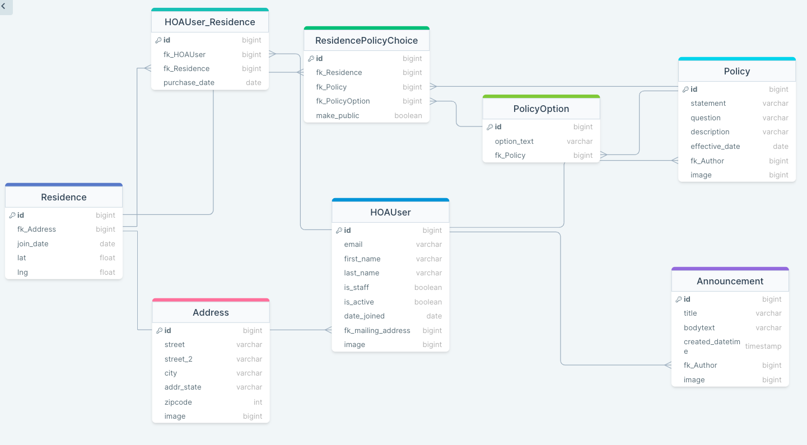

# Welcome to HomeTree, by Brian MacLean -- a demo homeowner's association website.
## Project requirements can be found here:
https://github.com/Code-Platoon-Curriculum/curriculum/blob/main/optional_lessons/personal_project.md

## Database Design / Schema

## Getting Started:

### Backend
0. Git pull the repo (as required)
1. Change directory to hometree/backend.
2. Create a virtual environment if needed.
   * python -m venv <venv_name>
3. Activate your virtual environment
   * source <venv_name>/bin/activate (e.g. 'default')
4. Install dependencies
   * pip install -r requirements.txt
5. Create/Configure the database ('hoa_db')
   * install PostgreSQL and create superuser
   * createdb hoa_db
   * python manage.py migrate 
   * Load fixtures (in the correct order):
    * python3 manage.py loaddata users/fixtures/auth_group_data_modified.json
    * python3 manage.py loaddata address_api/fixtures/address_data.json
    * python3 manage.py loaddata users/fixtures/user_data.json
    * python3 manage.py loaddata announcement_api/fixtures/announcement_data.json
    * python3 manage.py loaddata hoa_api/fixtures/residence_data.json
    * python3 manage.py loaddata hoa_api/fixtures/hoauser_residence_data.json
    * python3 manage.py loaddata policy_api/fixtures/policy_data.json
    * python3 manage.py loaddata policy_api/fixtures/policy_option_data.json
    * python3 manage.py loaddata policy_api/fixtures/residence_policy_choice_data.json
6. Start the backend server
   * python manage.py runserver

### Frontend
7. Change directory to frontend.
8. Install dependencies
   * npm install
9. Configure BASE_URL in constants.js for test or production
10. Start the frontend server (http://localhost:3000)
   * npm start

### Third-party APIs
11. If the Google Map display doesn't show, remind the author (above) to activate the Google APIs (maps, static maps, address validation, etc.).

### Testing
12. In the command line, type:
npx cypress run

### Most important
13.  Have fun, and feel free to create your own user account with a profile picture!

### Notes
* Any images uploaded to deployed site should be less than 1MB

## Design Requirements:
* The HOA app will:
  * Feature a custom user model on the backend:
    - Provide authentication, permissions to allow auth/permissions-based data
  * Feature permissions-based actions on front-end
    - Display of links
    - Routing
    - API calls
  * Feature re-usable forms (using form modes) and allow sequential display of different forms (form types)
  * Feature permissions-based views on back-end
  * Use Google MAPs API to display a map on the home page via backend proxy
    - The map will mark all the residence locations in the neighborhood
  * Use Google Address Validation API to validate addresses via backend proxy
  * Use OpenWeatherMap API to display current weather data via backend proxy
  * Feature a User Profile page
    - Users will be able to update their email, name, password, profile picture, and address
  * Feature a Policy Preferences page ('Policies')
    - This will allow users to vote on policy questions
    - This will allow users to view how votes were counted for a particular policy
  * Feature comprehensive create, read, update, delete actions on all data elements
    - Requires admin-level permissions
  * Feature mobile-responsiveness for all basic user interactions

## TODO:
  * Frontend:
    - User updates result in delayed success response until a different page is loaded
    - Manage page transitions more smoothly
    - wrap backend API calls in useEffect (use 'active' variable)
    - use httponly cookies (see Adam's video and demo code)
            
  * Backend:
    - re-download fixtures
    - enable httponly cookies
    - Add a neighborhood chat function
  
  * Deploy:
    - 

  * Future Features:
  - Put the script tag from https://developers.google.com/maps/documentation/javascript/reference/advanced-markers
      in public/index.html (at the bottom of the body). And see if you can enable hover/click functionality on the map icons
      in MapDisplay. See example here:
      https://github.com/googlemaps/extended-component-library/tree/main/examples/js_sample_app/src
      Otherwise wait until vis.gl provides the functionality, put pins on the community map for each 
    residence, when you hover over them, make them show the address

  - Update timezone correctly on backedn for creating/updating announcements.  Right now
    announcements are created with local Zulu time, which looks wierd on frontend (early)

  - Some users may leave an update form filled but uncommitted for a long time, while
    users elsewhere may have changed the data on the server in the meantime.  Before
    executing an update, compare the original (fetched) object data at the frontend
    against the current backend data.  If they are different, warn the user and confirm
    they want to execute the update.
  - Deal with exhaustive deps warnings:
    reference: https://stackoverflow.com/questions/60620248/avoiding-eslint-react-hooks-exhaustive-deps-warnings-with-useeffect-usestate

## User Stories (Address):
- Admin User creates address by providing all fields, with an image
- Admin User creates address by providing all fields, without an image
- Admin User creates address by providing all fields, selects an image then changes their mind (removes image selection)
- Admin User tries to create address, but misses some fields and receives error feedback
- Admin User tries to create an address that already exists, display an error that the address already exists (a regular user wouldn't get the feedback, it would just forego creating the new address and return the data to the user registration form
- A basic user creates a user account with a mailing address.  The user later deletes the address.
  The user later tries to update their address.  The user tries to add another address through Postman.
- The primary way users interact with address objects is through the frontend UserManager, ProfileManager, and ResidenceManager views.
